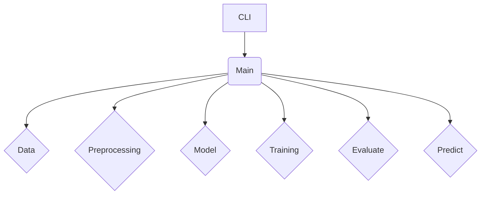

# Project Architecture

This page describes the architecture of the Simple ML Pipeline.

## Components

The pipeline is composed of several Python modules, each responsible for a specific part of the workflow.

- **`cli.py`:** The command-line interface for running the pipeline. It parses command-line arguments and calls the `main` function.
- **`main.py`:** The main entry point of the pipeline. It orchestrates the entire workflow, from data generation to model evaluation and saving.
- **`data.py`:** Generates synthetic data for the linear regression model.
- **`preprocessing.py`:** Preprocesses the data, including splitting it into training and testing sets.
- **`model.py`:** Defines the simple linear regression model using PyTorch.
- **`training.py`:** Trains the model using the training data.
- **`evaluate.py`:** Evaluates the trained model on the test data.
- **`predict.py`:**  Provides a function to make predictions on new data points using the trained model.
