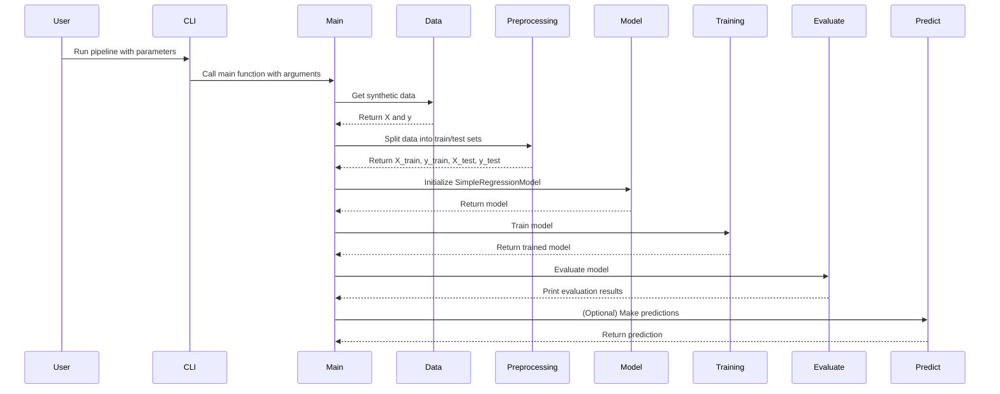

# Data Flow

This page describes the data flow within the Simple ML Pipeline.

## Data Flow Diagram

The following diagram illustrates how data flows through the different components of the pipeline.

